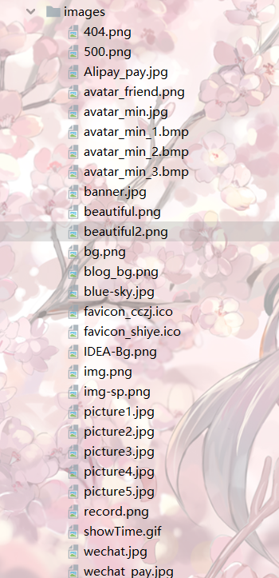

# 捶捶自己博客的介绍

> 基于李仁密老师的视频开发并自己新增了一些内容

## 新增内容

前端博客美化效果：雪花效果，动态背景线条效果，点击显示文字效果

- 雪花效果相关配置：
    - resources/static/js/snow.js文件内，有详细注释说明 可配置雪花颜色，大小，密集程度

- 动态背景线条相关配置：
    - comments.html中 可配置颜色，透明度

- 点击显示文字效果相关配置：
    - resources/static/js/click_show_text.js文件内，可自定义随机显示的文字

- 引入网易云音乐插件，固定在左下角
    - 底部footer网站运行计时，在_fragments.html文件createtime( ) JS方法内自行替换建站时间

## 图片地址url：

> 由于没有将图片存储到数据库的功能，所以直接存了一些图片进入了blog文件夹中，只要路径正确即可
默认为路径为：/images/picture1.jpg 或 /images/picture2.jpg 以此类推

 附上图片库

